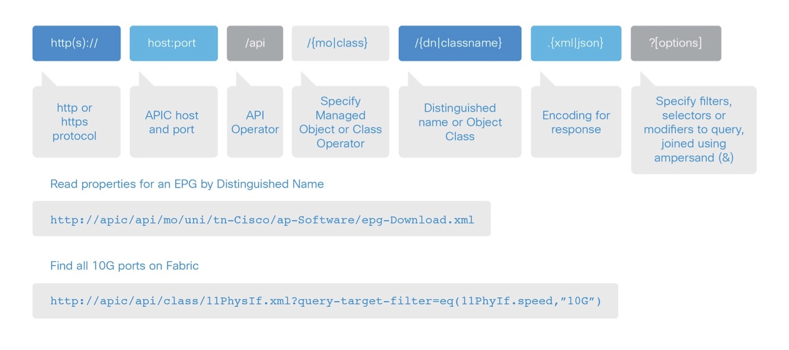
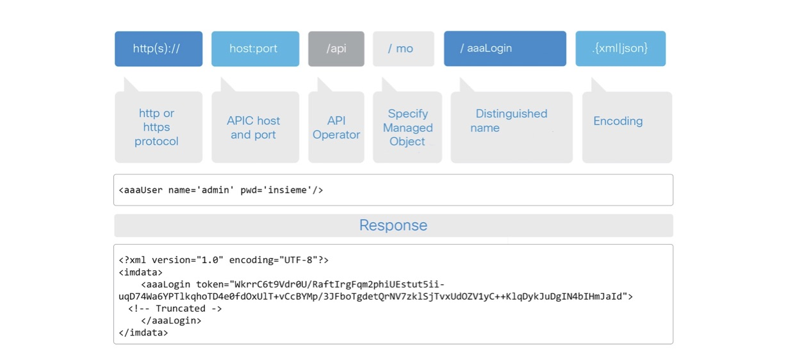
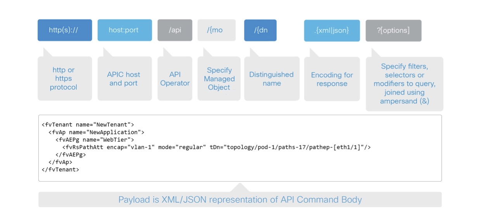
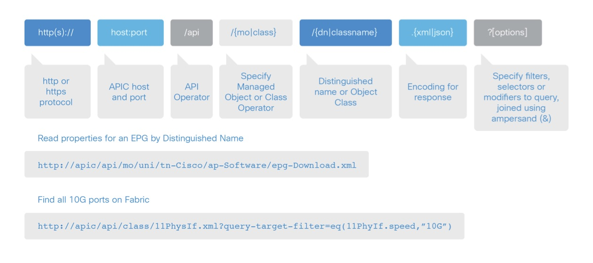
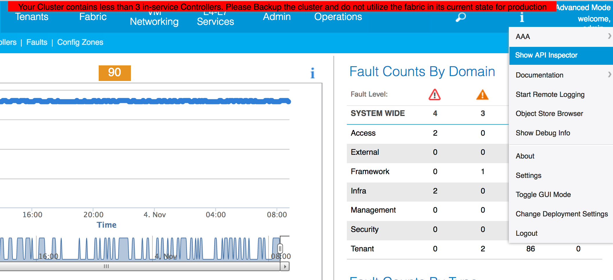
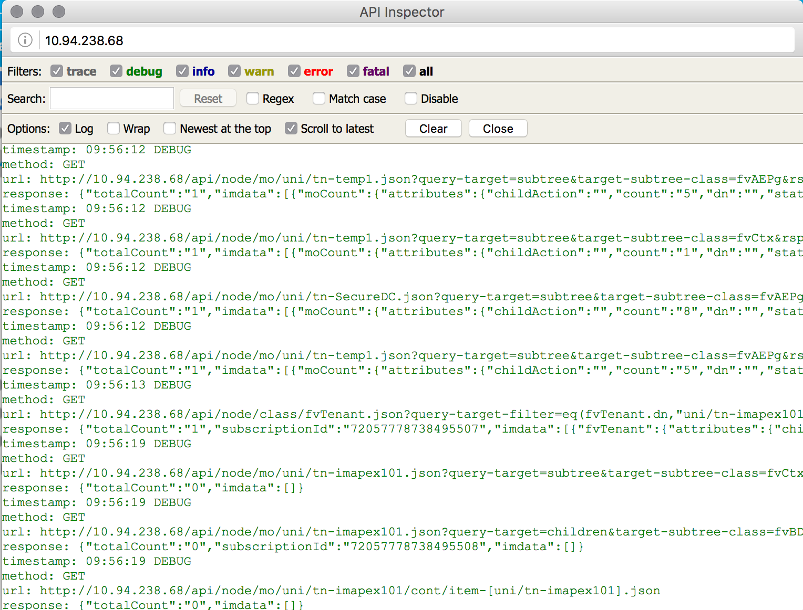
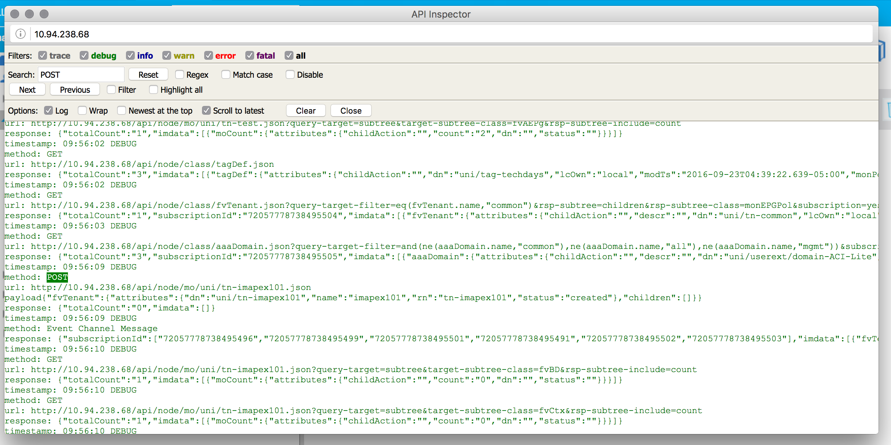

This guide is intended to be used as an intoduction to how you can interact with ACI in a programatic fashion.

[item]: # (slide)
##Main Topics
* System Overview
* ACI REST API
* ACI Python SDK
* ACI Tool Kit
* References

[item]: # (/slide)

[item]: # (slide)
##System Overview
Need to put some stuff in here

[item]: # (/slide)
 
[item]: # (slide)
#ACI REST API

The API schema follows ACI's Object Model

[item]: # (/slide)

[item]: # (slide)
##Supported REST Methods 
| Method | Action|
| ------ |--------|
| POST | Create / Update | 
| GET | Read | 
| DELETE | Delete |

[item]: # (/slide)

[item]: # (slide)
## REST API: Authentication


[item]: # (/slide)

[item]: # (slide)
## REST API: Create/Update Operations


[item]: # (/slide)

[item]: # (slide)
## REST API: Read Operation


[item]: # (/slide)

[item]: # (slide)
## REST API Inspector


[item]: # (/slide)

To open the API Inspector, click your name in the top right corner of the ACI GUI and click Show API Inspector

---

The APIC inspector will show all the API calls the APIC GUI makes while you are using it.  This is a great reasorce to get started.

[item]: # (slide)



[item]: # (/slide)


[item]: # (slide)
###Example of creating a Tenant in the GUI


We can see the interesting code here:

```json
method: POST
url: http://10.94.238.68/api/node/mo/uni.json
payload{"polUni":{"attributes":{"dn":"uni","status":"modified"},"children":[{"fvTenant":{"attributes":{"dn":"uni/tn-imapex101","status":"deleted"},"children":[]}}]}}
response: {"totalCount":"0","imdata":[]}
```

[item]: # (/slide)

[item]: # (slide)
##Labs
* [Devnet Learning Lab - ACI 102 - API Overview](https://learninglabs.cisco.com/lab/aci-102-api-overview/step/1)
* [Devnet Learning Lab - ACI 103 - API Inspector](https://learninglabs.cisco.com/lab/aci-103-building-a-simple-script/step/1)

---

[item]: # (slide)
#ACI's Python SDK
* Cobra is a native Python language binding for APIC REST API
* Supports lookups, creations, modifications, deletions
* Objects in Cobra are a 1:1 representation of objects in the MIT
  * As a result, policy created via GUI/JSON/XML can be used as a programming template, for more rapid development
  * All data has client side consistency checks performed
* Packaged as .egg, install with easy_install

[item]: # (/slide)

[item]: # (slide)
###Downloading the SDK
The SDK eggs are stored on the APIC controller in the following location:

```
http[s]://<APIC_URL>/cobra/_downloads
```

Download the Eggs:

```
$ wget http://<APIC_URL>/cobra/_downloads/acicobra-2.0_1o-py2.7.egg
$ wget http://<APIC_URL/cobra/_downloads/acimodel-2.0_1o-py2.7.egg
```

[item]: # (/slide)

[item]: # (slide)
###Installing the SDK

```
$ easy_install -Z acicobra-1.1_1j-py2.7.egg
$ easy_install -Z acimodel-1.1_1j-py2.7.egg
```

[item]: # (/slide)

[item]: # (slide)
###Authentication
The SDK takes care of staying logged into the fabric for you.  Example code to handle login and session.

```python
import cobra.mit.access
import cobra.mit.session

APIC_URL = 'http://<APIC_IP>'
APIC_USERNAME = 'username'
APIC_PASSWORD = 'password'

ls = cobra.mit.session.LoginSession(APIC_URL, APIC_USERNAME, APIC_PASSWORD)

md = cobra.mit.access.MoDirectory(ls)

md.login()
```

[item]: # (/slide)

[item]: # (slide)
###Object Lookup

Objects can be looked up using various methods

* Lookup by DN:
```python
uniMo = md.lookupByDn('uni')
```
* Lookup by Class:
```python
uniMo = md.lookupByClass('polUni')
```

[item]: # (/slide)

[item]: # (slide)
###Object Creation
TODO - Add content

[item]: # (/slide)

[item]: # (slide)
###Example 1
Example Tenant Creation using SDK

```python
from cobra.model.fv import Tenant
from cobra.model.pol import Uni
from cobra.mit.request import ConfigRequest
uniMo = Uni('')  # Uni is a static Mo, so we don’t need to look it up
t = Tenant(uniMo, 'Tenant1')  # We create a tenant as a child of the universe
c = ConfigRequest()  # Create a ConfigRequest to contain our new object
c.addMo(t)  # Add our tenant to the ConfigRequest
moDir.commit(c)  # Commit our configuration request
```

[item]: # (/slide)

[item]: # (slide)
###Example 2
Example 3 tier app creation using SDK

```python
from cobra.model.fv import *
from cobra.model.pol import Uni
uniMo = Uni('')
t = Tenant(uniMo, 'Tenant1')
ap = Ap(t, 'Exchange')
epg1 = AEPg(ap, 'OWA')
epg2 = AEPg(ap, 'FrontEnd')
epg3 = AEPg(ap, 'MailBox')
ep = RsPathAtt(epg1, tDn=‘topology/pod-1/paths-17/paths-[eth1/1]’, mode=‘regular’, encap=‘vlan-10’)
c = ConfigRequest()
c.addMo(t)
moDir.commit(c)
```

[item]: # (/slide)

[item]: # (slide)
##Links
* [APIC Rest API User Guide](http://www.cisco.com/c/en/us/td/docs/switches/datacenter/aci/apic/sw/1-x/api/rest/b_APIC_RESTful_API_User_Guide.html)
* [SDK Source Code and Documentation](https://github.com/datacenter/cobra)
* [Code Examples](https://github.com/datacenter/aci)

[item]: # (/slide)

---

[item]: # (slide)
#[ACI Toolkit](http://github.com/datacenter/acitoolkit)
ACI toolkit is a community driven project whith a goal of lowering the bar of entry to programmatically control the ACI fabric.  ACI Toolkit is not 100% comprehensive and does not include the full ACI object model.

In addtion to the simplified model, ACI toolkit also includes useful utilities.

[http://github.com/datacenter/acitoolkit](http://github.com/datacenter/acitoolkit)

[item]: # (/slide)

[item]: # (slide)
##Installation
The easiest way to get started using the ACI Toolkit is to install via pip

```
$ pip install acitoolkit
```

You can also download and install from github, instructions included there

[item]: # (/slide)


[item]: # (slide)
##Arya
One of the more useful tools when learning to programmatically work with ACI is Arya. Arya translates from ACI Rest to Python (ACI Cobra SDK).

[item]: # (/slide)

[item]: # (slide)
###Example
```
$ arya -s
{"polUni":{"attributes":{"dn":"uni","status":"modified"},"children":[{"fvTenant":{"attributes":{"dn":"uni/tn-imapex101","status":"deleted"},"children":[]}}]}}

#!/usr/bin/env python
'''
Autogenerated code using arya
Original Object Document Input: 
{"polUni":{"attributes":{"dn":"uni","status":"modified"},"children":[{"fvTenant":{"attributes":{"dn":"uni/tn-imapex101","status":"deleted"},"children":[]}}]}}

'''
raise RuntimeError('Please review the auto generated code before ' +
                    'executing the output. Some placeholders will ' +
                    'need to be changed')

# list of packages that should be imported for this code to work
import cobra.mit.access
import cobra.mit.session
import cobra.mit.request
import cobra.model.pol
import cobra.model.fv
from cobra.internal.codec.xmlcodec import toXMLStr

# log into an APIC and create a directory object
ls = cobra.mit.session.LoginSession('https://1.1.1.1', 'admin', 'password')
md = cobra.mit.access.MoDirectory(ls)
md.login()

# the top level object on which operations will be made
topMo = cobra.model.pol.Uni('')

# build the request using cobra syntax
fvTenant = cobra.model.fv.Tenant(topMo)
fvTenant.delete()


# commit the generated code to APIC
print toXMLStr(topMo)
c = cobra.mit.request.ConfigRequest()
c.addMo(topMo)
md.commit(c)
```

[item]: # (/slide)

This is an extreamly useful way to learn the object model and how to work with API in Python.  You can leverage the ACI API inspector to follow your actions in ACI, then feed that into Arya to generate the Python code